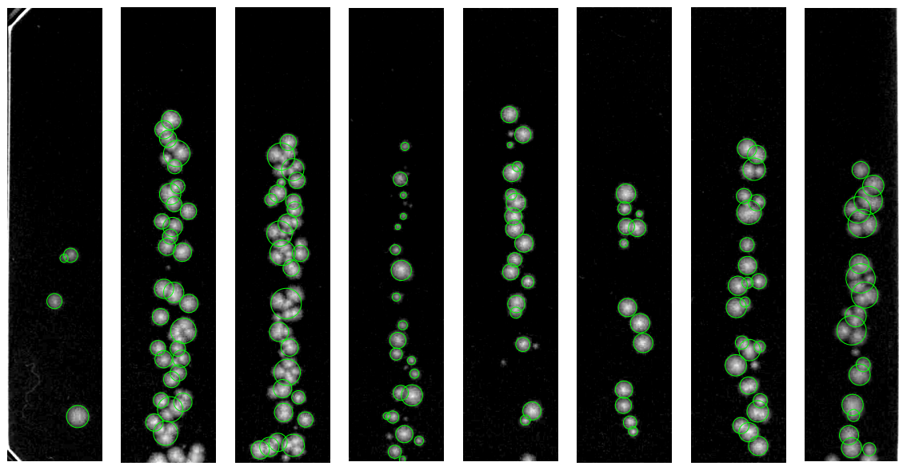

# colony_recognition

Count bacterial colonies on photos of agar plates.

The script compares a photo of a plate with colonies to a photo of an empty
plate (background), detects round objects, and counts them. A small interactive
tool lets you correct the count by hand where the automatic detection is wrong.

## Parts

- `ColonyCounter`: crops the plate image and the background and splits them into sections.
- `ColonyRecognition`: finds colonies in a section (thresholding, watershed
  segmentation, size filters) and fits a circle to each.
- `CorrectColonyCount`: interactive window to add or remove colonies by click.

## Installation

```bash
git clone https://github.com/maltemuetter/colony_recognition.git
pip install -r colony_recognition/requirements.txt
```

Put the folder that contains `colony_recognition/` on your Python path.

## Example

The `example/` folder contains a background image and a test image:

```python
from colony_recognition import ColonyCounter, CorrectColonyCount

counter = ColonyCounter("background.png")
recognition = counter.analyze_section("test.png", 2)

correction = CorrectColonyCount(recognition, "test")
correction.manual_correct()
```

Automatic detection on the eight sections of the example plate:



## Context

Written during my PhD at ETH Zurich to count colonies (CFU) from plating
experiments faster than by eye.

## License

MIT, see `LICENSE`.
